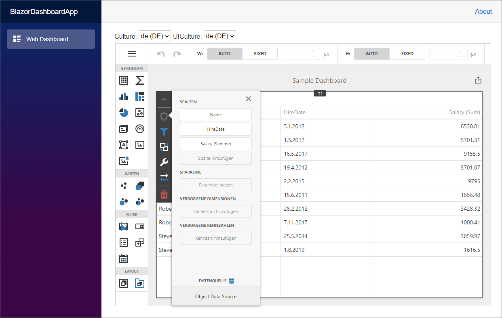

<!-- default badges list -->

<!-- default badges end -->
# Dashboard for Blazor WebAssembly - Localization

The example shows how to localize the Dashboard component in Blazor WebAssembly applications:

- Translate UI element captions to a different language: dialog boxes, buttons, menu items, error messages, and so on (localization).
- Format numbers, dates, and currencies according to specific culture settings (globalization).

The app uses **JSON strings** to localize the Dashboard component. You can obtain these strings from our [Localization Service](https://docs.devexpress.com/LocalizationService/16235/localization-service).

A custom [CultureSelector](./CS/BlazorDashboardApp/BlazorDashboardApp.Client/Components/CultureSelector.razor) UI component is implemented to allow users to change the culture at runtime. The app saves the current culture in [local storage](https://www.w3schools.com/html/html5_webstorage.asp) within the user's browser.

The [ResourceManager.setLocalizationMessages](https://docs.devexpress.com/Dashboard/js-DevExpress.Dashboard.ResourceManager?p=netframework#js_devexpress_dashboard_resourcemanager_setlocalizationmessages_static_localizationmessages_) method is used to localize the specified string at runtime (the "Export To" button's caption in the dashboard title).

## Files to Look At

* [Dashboard.razor](./CS/BlazorDashboardApp/BlazorDashboardApp.Client/Pages/Dashboard.razor)
* [CultureSelector.razor](./CS/BlazorDashboardApp/BlazorDashboardApp.Client/Components/CultureSelector.razor)
* [index.html](./CS/BlazorDashboardApp/BlazorDashboardApp.Client/wwwroot/index.html#L18-L27)
* [Program.cs](./CS/BlazorDashboardApp/BlazorDashboardApp.Client/Program.cs)
* [DashboardWasmLocalizationProvider.cs](./CS/BlazorDashboardApp/BlazorDashboardApp.Client/DashboardWasmLocalizationProvider.cs)

## Documentation

- [Create a Blazor WebAssembly Dashboard Application](https://docs.devexpress.com/Dashboard/401892?v=21.1)

## More Examples

- [Dashboard for Blazor Server - Localization](https://github.com/DevExpress-Examples/dashboard-blazor-server-localization)
- [Dashboard Blazor WebAssembly App - Configuration](https://github.com/DevExpress-Examples/dashboard-blazor-webassembly-configuration)
- [Dashboard Blazor WebAssembly App - JavaScript Customization](https://github.com/DevExpress-Examples/dashboard-blazor-webassembly-js-customization)
